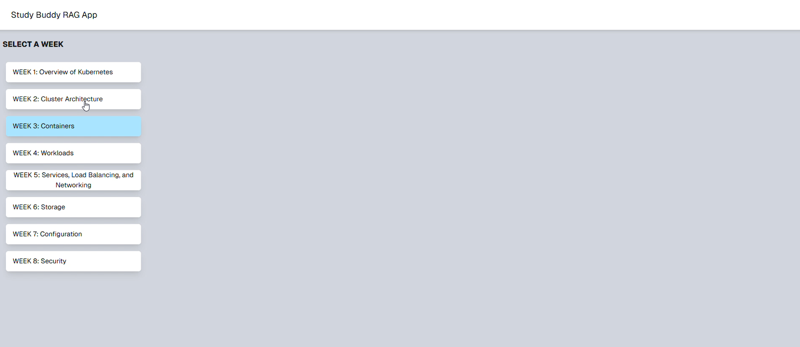

# AI RAG (Retrieval Augmented Generation) Application using Langchain and Nextjs

Retrieval Augmented Generation (RAG)
Retrieval-Augmented Generation (RAG) is an AI architecture that improves LLM responses by grounding them in external data.
Instead of relying only on what the model was trained on, RAG:

- Retrieves relevant information from a knowledge base (e.g., vector database)
- Augments the prompt with that retrieved context
- Generates a response using the LLM based on that context

**How It Works**

```
User Question
      ↓
Embed the question
      ↓
Search vector database (similarity search)
      ↓
Retrieve top-K relevant documents
      ↓
Inject documents into prompt
      ↓
LLM generates grounded answer
```

**Why Use RAG?**
- Reduces hallucinations
- Uses your own data (private docs, course material, PDFs, etc.)
- Keeps responses up-to-date
- Makes LLM answers traceable to source content

## Langchain
LangChain is a framework for building applications powered by Large Language Models (LLMs). It provides abstractions for prompts, chains, retrieval systems, memory, and tool integration, making it easier to build structured, production-ready AI applications instead of simple API calls.
It enables developers to:
- Orchestrate multi-step LLM workflows
- Build Retrieval-Augmented Generation (RAG) systems
- Manage prompt templates and structured outputs
- Integrate vector databases and external tools
- Add conversational memory

LangChain helps transform raw LLM access into scalable AI systems. Langchian docs - https://docs.langchain.com/oss/python/langchain/overview


## Study Buddy for Kubernetes:

This project implements a **LangChain-powered Retrieval-Augmented Generation (RAG)** pipeline to build a smart study assistant that answers questions using course-specific content rather than generic pretrained knowledge.
When a user asks a question, the system:

- Searches relevant course material in a vector database
- Retrieves the most relevant content
- Uses an LLM to generate a grounded, context-based answer
- Reduces hallucinations
- Provides accurate, course-aligned answers
- Demonstrates real-world AI system design

Rather than just calling an API, this project demonstrates building a structured, retrieval-driven AI system designed for accuracy and scalability.
Instead of relying solely on pretrained model knowledge, the system:

- Converts user queries into vector embeddings
- Performs similarity search against a Supabase vector store
- Retrieves the top-K relevant document chunks
- Injects the retrieved context into a structured prompt
- Generates a grounded response using an OpenAI chat model

In this project, LangChain is used to implement a Retrieval-Augmented Generation (RAG) pipeline.
Specifically, it is used to:

- Create a Supabase-backed vector retriever
- Convert stored embeddings into a retriever interface
- Build a composable RAG chain using Runnable pipelines
- Inject retrieved context into a structured prompt template
- Manage conversational history using MessagesPlaceholder

LangChain orchestrates the full flow:

```
User Question
   ↓
Retriever (Supabase Vector Store)
   ↓
Prompt Template (Context Injection)
   ↓
OpenAI Chat Model
   ↓
Grounded Response
```
Instead of directly calling an LLM, LangChain enables a modular and extensible AI architecture, ensuring responses are context-aware, scalable, and maintainable.

### Tech Stack

**Core Application**
- **Next.js** – Full-stack React framework used for building the UI and API routes
- **Tailwind CSS** – Utility-first styling for responsive and modern UI design

**AI & RAG Layer**
- **LangChain (JS/TS)** – Orchestrates the RAG pipeline, prompt templates, and retrieval flow
- **OpenAI GPT (gpt-5-mini)** – Generates grounded responses based on retrieved context
- **OpenAI Embeddings (text-embedding-3-small)** – Converts text into vector representations for semantic search

**Data & Retrieval**
- **Supabase (Postgres + pgvector)** – Stores document embeddings and performs vector similarity search

**Deployment**
- **Vercel** – Serverless deployment platform optimized for Next.js applications

### Project Architecture

```
User Query
   ↓
OpenAI Embeddings (text-embedding-3-small)
   ↓
Supabase Vector Store (pgvector similarity search)
   ↓
Top-K Documents
   ↓
Prompt Template (Context Injection)
   ↓
OpenAI Chat Model (gpt-5-mini)
   ↓
Final Answer
```

**Project URL** - https://ai-rag-langchain-app.vercel.app/studyBuddy

**Project Demo**

[](https://youtu.be/xqMbjzXfXls)

**Documentation for K8s Ingestion** - https://kubernetes.io/docs/concepts/


